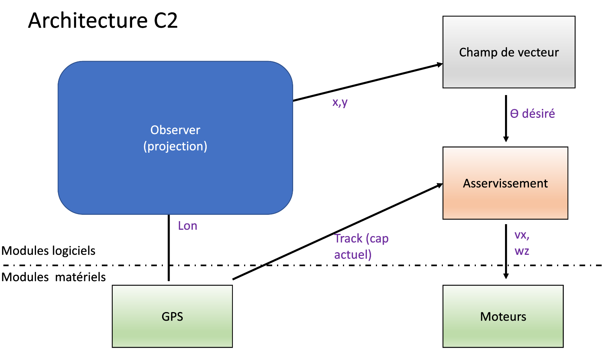
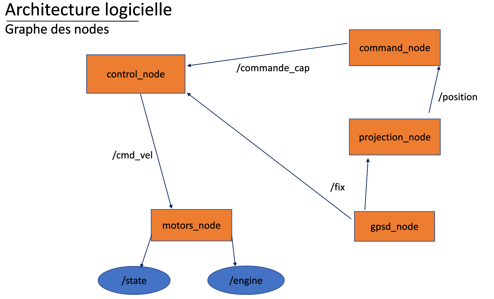

# Bagnole - Projet ROS2


## Présentation du projet

Ce projet a pour but de faire faire le tour d'un terrain de sport à une petite voiture motorisée de façon autonome. Nous utiliserons pour cela le middleware ROS2. 

Nous disposons de deux capteurs : 
* un GPS
* une webcam

Nous avons pour l'instant utilisé seulement le GPS pour le contrôle de la voiture. L'implémentation d'un contrôle avec la caméra, par suivi de ligne par exemple, pourrait être utilisée en complément du GPS pour compenser les éventuelles imprécisions de celui-ci. 

L'ensemble de notre projet sera codé en C++.

## Architecture C2



## Node graph




### Projection node

Ce node a pour but de récupérer les coordonnées récupérées au format ``lat,lon`` par le GPS pour les projeter en coordonnées x,y (utm). Il les publie ensuite dans un message de type ```PoseStamped```.
Nous utilisons pour cela la librairie Proj.

### Command node

Ce node récupère les coordonnées projetées, et calcule à partir de celles-ci un champs de vecteurs correspondant à la trajectoire à suivre. Il renvoie l'angle désiré au format ```Float32```.


### Control node

Ce node reçoit le cap désiré ainsi que le cap mesuré par le GPS, et utilise un correcteur proportionnel pour calculer la commande. Il envoie ensuite cette commande au format ```Twist```.

### Motors node
See [voiture2a_motors_driver](./src/voiture2a_motors_driver/README.md) package

### GNSS node
See [gpsd client](./src/gpsd_client/README.md) package

### Camera node
https://index.ros.org/r/usb_cam/

## Lancement du projet

Il faut pour cela se connecter en ssh à la voiture avec la commande suivante :

```bash 
ssh pi@192.168.0.110
```
Lancer ensuite le fichier launch :
```bash 
python launch/launch_voiture.py
```