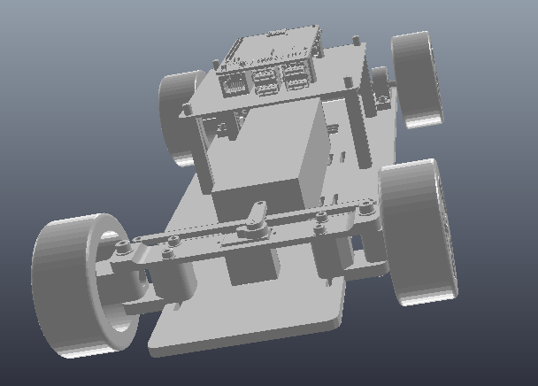
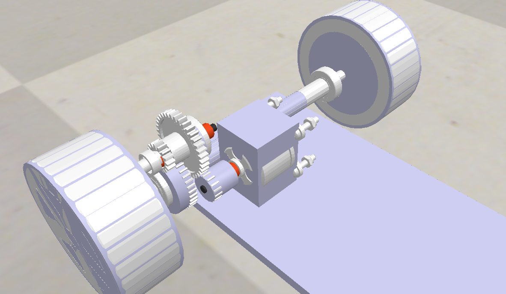

# BAGNOLE - Simulation

## Présentation du projet

L'objectif de ce projet est de simuler une petite voiture à l'aide du logiciel CoppeliaSim. 

Nous disposons de la CAO de la voiture, dont nous devrons ensuite faire une modélisation dynamique. Nous contrôlerons la voiture à l'aide de sockets, ainsi que de ros2, le tout codé en Python. 

## Modélisation dynamique

### Partie arrière 

La partie arrière est la partie motrice de la voiture. La problématique principale de cette partie était la présence d'engrenages reliant le moteur et l'axe des roues. Nous avons envisagé plusieurs solutions :

* l'utilisation de roues à friction pour modéliser les engrenages. Cela nécessitait l'utilisation de dummies, que nous n'avons pas réussi à faire fonctionner correctement, nous avons donc opté pour la deuxième solution.

* une modélisation simplement esthétique des engrenages. Nous avons pour cela utilisé une liaison pivot dynamique suivie de deux liaisons pivot dépendantes. Cela permet de faire tourner visuellement les pièces esthétiques. 

### Partie avant

## Contrôle à l'aide de sockets

## Contrôle à l'aide de ros2

Lien vers la documentation de pyproj, librairie utilisée pour faire des projections de lat,lon vers x,y : https://pyproj4.github.io/pyproj/stable/api/proj.html

